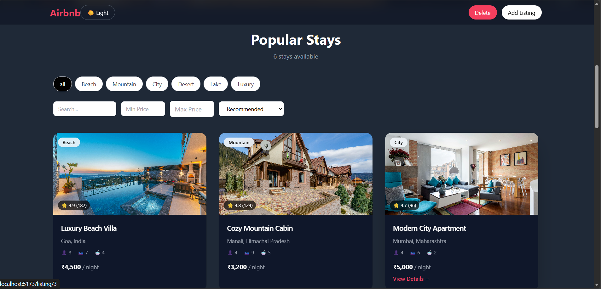

# 🏡 Airbnb Clone – React + Tailwind

A modern Airbnb-inspired listing application built with React and Tailwind CSS.  
Users can add, edit, delete and rate property listings with persistent local storage.

---

## 🚀 Live Demo

👉 👉 [View Live Project](https://airbnb-clone-smoky-kappa.vercel.app/)

---

## 📸 Preview




## 📌 Features

- Add new listings
- Edit existing listings
- Delete listings (with confirmation modal)
- Star rating system with dynamic average calculation
- Dark mode support
- LocalStorage persistence
- Smooth route transitions
- Responsive layout

---

## 🛠 Tech Stack

- React
- React Router
- Tailwind CSS
- Vite
- LocalStorage API

---

## 🧠 Architecture Highlights

- Custom Hook (`useListings`) for CRUD logic
- UI state separated from data logic
- Reusable components (Navbar, ListingCard, DeleteModal, etc.)
- Clean folder structure
- Dark mode persistence

---

## 📂 Folder Structure

```
src/
  components/
  pages/
  hooks/
  data/
  App.jsx
  main.jsx
```

---

## ⚙ Installation

```bash
# Clone repository
git clone <your-repo-link>

# Navigate into project
cd airbnb-project

# Install dependencies
npm install

# Run development server
npm run dev
```

---

## 👨‍💻 Author

Rajdeep Singh  
Built with React & Tailwind

---

## 📄 License

This project is built for educational and portfolio purposes.
