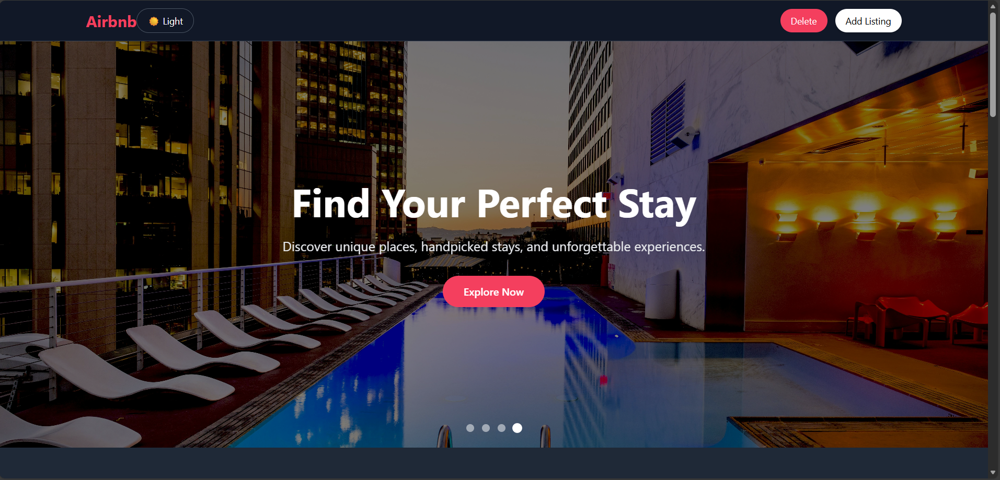

# 🏡 Airbnb Clone – Production-Ready React Application

A fully responsive Airbnb-inspired listing platform built using **React, Tailwind CSS, and Vite**.  
This project focuses on clean architecture, performance optimization, strict data validation, and production-ready deployment.

---

## 🚀 Live Demo

👉 https://airbnb-clone-smoky-kappa.vercel.app/

---

## 📸 Preview

  

---

## ✨ Core Features

- Add new listings
- Edit existing listings
- Delete mode with toggle interaction
- Dynamic star rating system (average calculation logic)
- LocalStorage persistence with strict validation
- Dark / Light mode with persistence
- Search by title and location
- Category filtering
- Price range filtering
- Sorting (Price & Alphabetical)
- Mobile-first responsive layout
- SPA routing with production deployment (Vercel)
- ErrorBoundary implementation for runtime safety

---

## 📊 Lighthouse Scores (Mobile)

- **Performance:** 90+
- **Accessibility:** 90+
- **Best Practices:** 100
- **SEO:** 80+

### Optimizations Applied

- Lazy loading for non-critical images
- Eager loading for above-the-fold hero image
- Image compression via query parameters
- Clean production build using Vite
- Reduced re-renders using `useMemo`

---

## 🛠 Tech Stack

- React (Hooks + Custom Hooks)
- React Router
- Tailwind CSS
- Vite
- LocalStorage API
- Vercel (Deployment)

---

## 🧠 Architecture & Engineering Decisions

### 🔹 Custom Hook – `useListings`

All CRUD logic and persistence are centralized inside a custom hook:

- Initial data hydration with validation
- Strict structure checking before using stored data
- Automatic sync to LocalStorage via `useEffect`
- Unique ID generation logic
- Rating average calculation

This ensures separation of UI and business logic.

---

### 🔹 State Flow

- Global listing state lives in the **App component**
- Data passed down via props
- Navbar controls UI state (delete mode, theme)
- Centralized update functions prevent duplication

---

### 🔹 LocalStorage Strategy

On application load:

1. Validate stored data structure
2. Reset to default if corrupted
3. Sync every state update automatically

This prevents undefined UI states and stale structure bugs.

---

## 📂 Folder Structure

src/
├── components/
├── pages/
├── hooks/
│ └── useListings.js
├── data/
├── App.jsx
└── main.jsx

---

## ⚙ Installation

git clone https://github.com/Rajdeepsingh24/airbnb-clone.git
cd airbnb-clone
npm install  
npm run dev

### Production Build

npm run build  
npm run preview

---

## 🎯 What This Project Demonstrates

- Production-ready SPA deployment
- State management using custom hooks
- Data validation strategies
- Performance optimization techniques
- Accessibility improvements (ARIA attributes)
- Clean and scalable component architecture
- Mobile-first responsive design

---

## 👨‍💻 Author

**Rajdeep Singh**  
Frontend Developer | React Enthusiast

---

## 📄 License

This project is built for educational and portfolio purposes.
